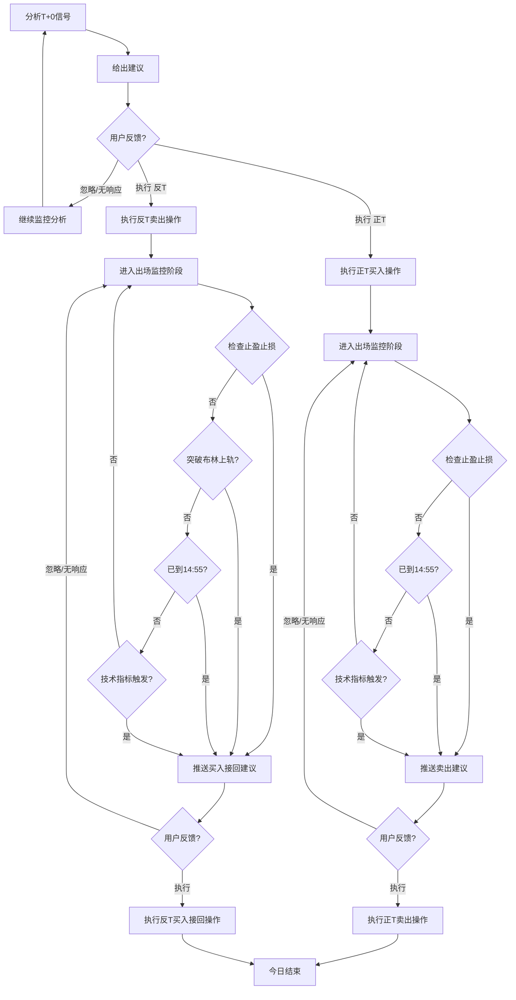

# 股票T+0智能决策系统 - 业务逻辑归纳

## 一、系统概述

本系统是一个基于技术分析的股票T+0日内交易决策工具，通过分析实时行情和技术指标，为用户提供正T（先买后卖）或反T（先卖后买）的交易建议，并在入场后持续监控止盈止损。决策报告中新增预测价字段，基于布林带和近期高低点综合计算目标价位。

系统采用新浪和腾讯双数据源作为行情数据来源，避免单一数据源连接失败问题。

## 二、技术指标体系

### 2.1 盘前分析阶段技术

盘前分析（`analyze_t0_signal`）用于判断是否给出T+0交易建议，使用以下技术指标：

| 指标 | 周期/参数 | 用途 |
|------|-----------|------|
| MA5 | 短期均线 | 判断价格偏离，正T条件：偏离 < -0.8%；反T条件：偏离 > +0.8% |
| MA20 | 长期均线 | 判断整体趋势方向 |
| RSI14 | 14周期 | 超卖区(<30)触发正T；超买区(>70)触发反T |
| MACD | EMA12/EMA26/DEA9 | 红柱缩短触发反T；绿柱缩短触发正T |
| 布林带 | 20日，2倍标准差 | 价格接近上轨触发反T；接近下轨触发正T |
| 近期高低点 | 最近10根K线 | 价格接近近期高点触发反T；接近近期低点触发正T |
| 预测价 | 布林带+近期高低点 | 正T取min(布林上轨,近期高点)；反T取max(布林下轨,近期低点) |

**信号优先级：**
1. **强烈信号**（正T决策/反T决策）：需要满足至少2个触发条件
2. **市场观点建议**：信号不强时，基于评分机制给出倾向性建议：
   - 评分项：RSI、MA5偏离、布林带位置、MACD柱方向，每项贡献±1分
   - ≥2分：反T建议（偏强）
   - ≤-2分：正T建议（偏弱）
   - ≥1分：反T建议（中性偏强）
   - 其他：正T建议（中性偏弱）

### 2.2 盘中监控阶段技术

盘中监控（`check_exit_signal` + `analyze_exit_decision`）用于入场后判断出场时机，使用以下技术：

| 技术 | 参数 | 用途 |
|------|------|------|
| 止盈止损 | 止盈2%，止损2% | 达到目标立即推送出场建议 |
| 尾盘强制平仓 | 14:55 | 收盘前强制要求恢复底仓，避免跨日风险 |
| 反T布林上轨保护 | 突破上轨0.3% | 反T卖出后股价上涨突破上轨，提前止损接回 |
| 动态出场建议 | RSI>55/布林带接近0.4% | 未触发止盈止损时，基于技术指标给出出场建议（需满足≥2个条件） |

## 三、业务流程图

### 3.1 主流程（Mermaid）



### 3.2 状态流转

| 状态 | 说明 | 触发条件 |
|------|------|----------|
| `entry` | 入场阶段 | 初始状态，等待首次建议 |
| `exit` | 出场阶段 | 用户确认执行买入/卖出后 |
| `done` | 交易完成 | 用户确认执行出场后 |

### 3.3 持仓状态

| 状态 | 说明 |
|------|------|
| `holding` | 持有底仓 |
| `bought_more` | 正T买入后，持仓增加 |
| `sold_part` | 反T卖出后，持仓减少 |

### 3.4 用户指令处理

| 指令 | 处理逻辑 |
|------|----------|
| 执行 | 确认决策，切换状态（entry→exit，exit→done） |
| 忽略 | 不回复或忽略消息，继续监控 |

## 四、核心配置参数

| 参数 | 值 | 说明 |
|------|-----|------|
| HOLDING_SHARES | 200 | 底仓股数 |
| MAX_POSITION_PCT | 0.5 | 单次T+0使用底仓比例 |
| STOP_LOSS_PCT | 0.02 | 止损比例 |
| TAKE_PROFIT_PCT | 0.02 | 止盈比例 |
| NEGATIVE_T_BOLLINGER_STOP_PCT | 0.003 | 反T上涨保护阈值 |
| RECENT_LOOKBACK | 10 | 预测价计算时近期高低点回看周期 |
| PREDICTED_PRICE_MIN_PCT | 0.005 | 预测价与当前价最小波动幅度（防止无意义预测） |
| EXIT_TRIGGER_RSI | 55 | 出场动态建议RSI阈值 |
| EXIT_TRIGGER_BOLLINGER_PCT | 0.004 | 出场动态建议布林带偏离比例 |

## 五、代码结构

```
trading_skill/
├── src/
│   ├── config.py          # 配置参数
│   ├── analyzer.py        # 技术分析逻辑
│   ├── data_fetcher.py    # 数据获取（新浪+腾讯双数据源）
│   ├── state_manager.py   # 状态管理
│   ├── logger.py          # 日志工具
│   ├── main.py            # 主入口
│   └── scenarios.py       # 场景测试脚本
├── scripts/
│   └── run_trading.sh     # 运行脚本
├── state.json             # 状态文件
├── requirements.txt       # 依赖列表
└── README.md              # 项目说明
```

## 六、关键函数说明

### 6.1 `analyze_t0_signal(kline_df, current_price, daily_kline)`

盘前信号分析主函数，依次检查：
1. 正T信号（`_check_positive_t_signal`）
2. 反T信号（`_check_negative_t_signal`）
3. 市场观点建议（`_generate_market_view_signal`）

返回包含 `trade_type`、`decision_type`、`suggested_action`、`predicted_price`、`target_price`、`stop_loss_price` 等字段的决策字典。

### 6.2 `_check_positive_t_signal(price, deviation, rsi, macd, bollinger, close_prices)`

检测正T信号（先买后卖），满足以下任一条件时记录原因，≥2个原因触发信号：
- 价格低于MA5超过阈值
- RSI处于超卖区(<30)
- 价格接近布林下轨（≤下轨×1.005）
- MACD绿柱缩短（macd<0且dif>dea）
- 价格接近近期低点（≤近期低点×1.003）

### 6.3 `_check_negative_t_signal(price, deviation, rsi, macd, bollinger, close_prices)`

检测反T信号（先卖后买），满足以下任一条件时记录原因，≥2个原因触发信号：
- 价格高于MA5超过阈值
- RSI处于超买区(>70)
- 价格接近布林上轨（≥上轨×0.995）
- MACD红柱缩短（macd>0且dif<dea）
- 价格接近近期高点（≥近期高点×0.997）

### 6.4 `_generate_market_view_signal(price, ma_short, ma_long, rsi, macd, bollinger, close_prices)`

当没有强烈信号时，基于评分机制生成市场观点建议：
- 评分项：RSI(>55/+1,<45/-1)、MA5偏离(>0.3%/+1,< -0.3%/-1)、布林带位置(>0.6/+1,<0.4/-1)、MACD柱(>0/+1,<0/-1)
- 根据总分给出不同倾向性建议

### 6.5 `check_exit_signal(current_price, entry_price, trade_type, bollinger)`

检查止盈止损和反T上涨保护，返回信号类型：
- `take_profit`：达到止盈目标
- `stop_loss`：触发止损
- `bollinger_stop`：反T突破布林上轨

### 6.6 `analyze_exit_decision(kline_df, current_price, entry_price, trade_type)`

未触发止盈止损时，基于技术指标给出动态出场建议（需满足≥2个条件）：
- 正T出场：价格高于MA5、RSI>55、价格接近布林上轨、MACD红柱缩短
- 反T出场：价格低于MA5、RSI<55、价格接近布林下轨、MACD绿柱缩短

### 6.7 `calculate_predicted_price(price, bollinger, close_prices, trade_type)`

计算预测价，综合布林带轨道和近期高低点：
- **正T（先买后卖）**：预测卖出价 = min(布林上轨, 近期高点)，取保守较低值
- **反T（先卖后买）**：预测买入价 = max(布林下轨, 近期低点)，取保守较高值
- 当保守预测不合理时（如低于买入价/高于卖出价），使用布林带轨道值 + 最小波动补偿

### 6.8 `run_analysis()`

主分析流程，处理三种场景：
1. 等待用户确认之前的决策（`confirmation`状态）
2. 今日已交易，检查止盈止损、尾盘强平或给出新的出场建议（`exit_signal`状态）
3. 今日未交易，分析入场信号（`decision`状态）

返回结果字典包含 `action`、`message`、`decision` 字段。

### 6.9 `handle_user_response(price)`

处理用户的回复（执行），由Skill在收到用户消息时调用：
- `price`: 用户输入的成交价格，作为入场价
- 调用 `confirm_decision(price)` 确认决策，切换交易阶段

## 七、场景测试脚本

`scenarios.py` 提供了9个测试场景，用于模拟不同交易阶段：

| 命令 | 场景说明 |
|------|----------|
| `pre` | 盘前等待建议（初始状态） |
| `pt_buy_wait` | 设置等待入场确认（正T买入） |
| `pt_buy_exec` | 执行入场（正T买入） |
| `pt_sell_wait` | 设置等待出场确认（正T卖出） |
| `pt_sell_exec` | 执行出场（正T卖出） |
| `at_sell_wait` | 设置等待入场确认（反T卖出） |
| `at_sell_exec` | 执行入场（反T卖出） |
| `at_buy_wait` | 设置等待出场确认（反T买入接回） |
| `at_buy_exec` | 执行出场（反T买入接回） |
| `show` | 显示当前状态 |

使用方式：`python scenarios.py <命令>`

## 八、数据获取

`data_fetcher.py` 使用新浪和腾讯双数据源，支持自动重试和数据新鲜度校验：

| 函数 | 用途 |
|------|------|
| `get_realtime_quote()` | 获取实时行情，优先腾讯接口，失败回退新浪 |
| `get_kline_data()` | 获取K线数据，支持数据过期检测和修正 |
| `get_daily_kline()` | 获取日K线数据（用于辅助分析） |

当K线数据与实时价格偏差超过1%时，会自动修正最后一根K线的收盘价为实时价格。